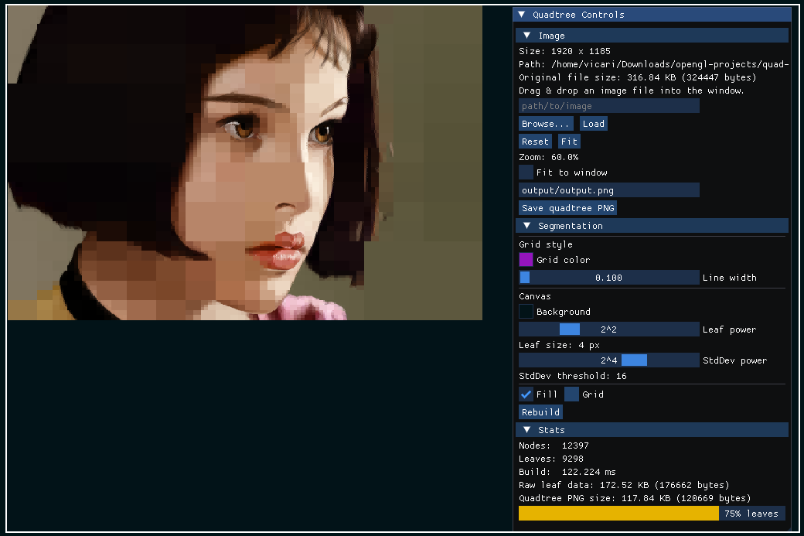

# 🌀 Quadtree Image Compression

## Developed by Jorge Guillermo Olarte Quispe

## Universidad Nacional del Altiplano – Ingeniería de Sistemas

A lightweight **C++ / OpenGL** app to visualize images using a **quadtree**.  
It splits the image into blocks: **large blocks** for flat areas, **small blocks** for detail.  
Play with sliders, zoom/pan the canvas, recolor the grid, and export the result as PNG.

## Screenshots

| Quadtree Grid                       | Grid (Tinted)                             | Compressed Images                        |
| ----------------------------------- | ----------------------------------------- | ---------------------------------------- |
|  |  |  |
|     |     |     |
|    |    |    |
|    |    |    |

> Screenshot UI:  
> 

## Build & Run

### Requirements

- C++17 compiler
- CMake ≥ 3.15
- OpenGL (fixed-function is fine)
- GLFW3
- (Linux) X11 + pthread + dl
- Vendored: Dear ImGui, stb, ImGuiFileDialog (already in `include/`)

### Linux / macOS

```bash
git clone https://github.com/ArtStyle19/quadtree-image-compression.git
cd quadtree-image-compression

rm -rf build
cmake -S . -B build
cmake --build build -j

# run
./build/bin/quadtree_viewer images/image.png
```

## Controls

- **Mouse wheel**: zoom in/out (anchored at cursor)
- **Drag (LMB/RMB)**: pan
- **Double-click (LMB)**: reset view
- **GUI (left panel)**:
  - _Leaf power_ (`2^k`) and _StdDev power_ (`2^k`)
  - Toggle **Fill** / **Grid**
  - **Grid color** picker + **line width**
  - **Canvas background** color picker
  - **Browse…** to load image; **Save PNG** to export
